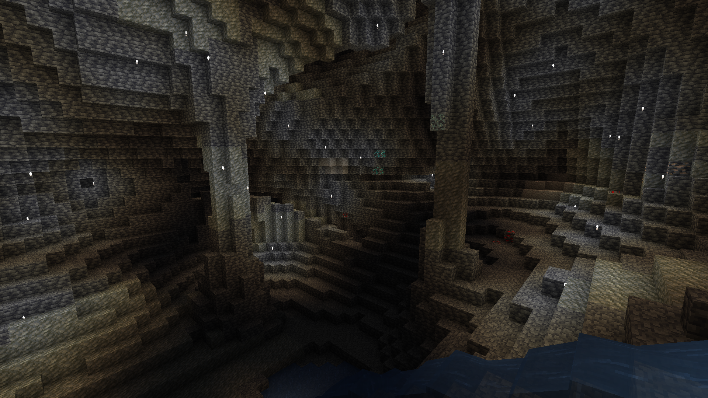

## Minecraft Survival Flares Datapack

<em>Created by FancyPotatOS</em>

A simple item that can light up a whole cave for a while

Before: 
After: 

### Configuration

Change the following scores to match your desired behaviour

- `max_lifetime survivalflares.lifetime`
    - _Default: **2400**_
    - How long each light particle lasts (in ticks)
- `flares_summoned survivalflares.flare_summons`
    - _Default: **30**_
    - How many light particles come from a single flare
    - Setting this to high values (>100) will mess with your server's TPS if players (little gremlins) spam too many of these

### Credits

Flare sound effects from [Pixabay](https://pixabay.com/sound-effects/igniting-a-match-80743/)

